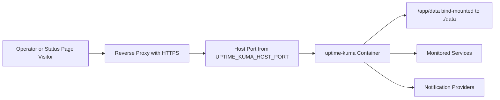

# Architecture

This repository runs Uptime Kuma as a single Docker Compose service with persistent data stored on the host. It is intentionally small: Compose defines the runtime, scripts handle local backup and restore, and documentation describes operator workflows.

## Components

- `compose.yaml` defines the `uptime-kuma` service, port mapping, bind-mounted data directory, health check, and dedicated Docker network.
- `.env` supplies deployment-specific values. `.env.example` documents safe defaults and is safe to commit.
- `data/` stores Uptime Kuma runtime data mapped to `/app/data` in the container.
- `scripts/` provides backup, restore, and validation utilities.
- `docs/` and `examples/` describe operations and deployment boundaries.

## Container Architecture

Uptime Kuma listens on the configured container port, `3001` by default. Docker Compose publishes that port on the host according to `UPTIME_KUMA_HOST_BIND` and `UPTIME_KUMA_HOST_PORT`.

The default host bind is `127.0.0.1`, which expects local access or a reverse proxy on the same host. Production HTTPS termination should happen outside this Compose service.

## Persistent Storage

The container path `/app/data` contains the Uptime Kuma database and generated runtime state. This repository maps that path to `./data` by default. The contents are ignored by Git and should be backed up before upgrades or host maintenance.

## Request Flow

For local-only use, the operator can connect directly to `http://127.0.0.1:3001`.

## Boundaries

Inside this repository:

- Docker Compose service definition.
- Example environment variables.
- Local backup and restore scripts.
- Operational documentation.
- Reverse-proxy guidance.

Outside this repository:

- DNS records and public domain ownership.
- TLS certificate issuance and renewal.
- Firewall and cloud security group rules.
- External reverse-proxy installation.
- Uptime Kuma monitor definitions as code.
- Long-term offsite backup storage.
